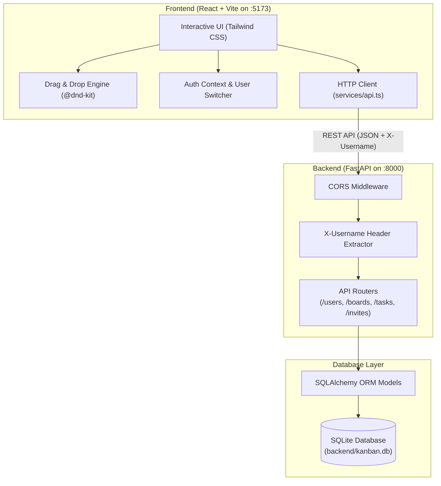
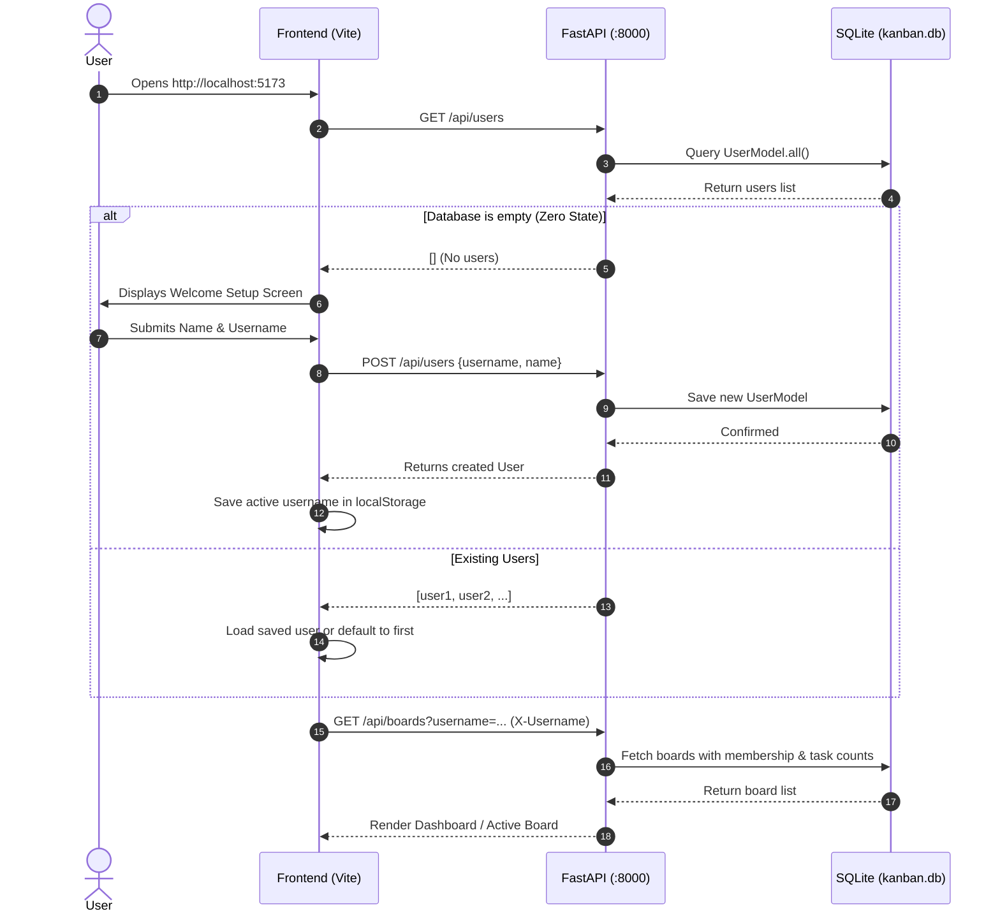
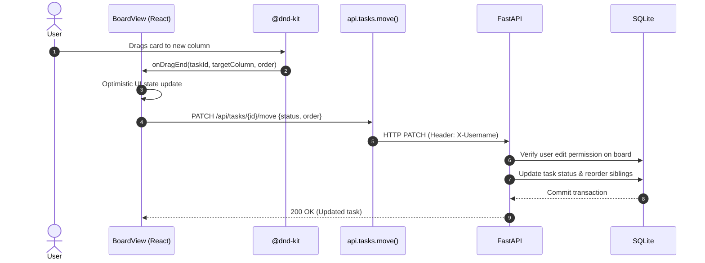

# kanban-bro

A full-stack Kanban board application with a FastAPI backend, SQLite/SQLAlchemy database, and React + TypeScript + Tailwind CSS frontend.

## 🚀 One-Click Run

### Option 1: Bash (Git Bash / Linux / macOS / WSL)
Run the single bash script at the root:
```bash
./run.sh
```
*(Press `Ctrl+C` in the terminal to stop both services cleanly).*

### Option 2: Windows Batch (File Explorer)
Double-click [run.bat](file:///c:/Users/rafah/Documents/ML/ai-dev-tools-zoomcamp/kanban-bro/run.bat) in the root directory. It will launch both services in dedicated terminals and automatically open `http://localhost:5173` in your browser.

---

## 🛠️ Manual Run

### 1. Backend (FastAPI + uv)
```bash
cd backend
uv sync
uv run uvicorn app.main:app --port 8000 --reload
```
- API URL: http://localhost:8000
- Interactive Swagger Docs: http://localhost:8000/docs

### 2. Frontend (React + Vite)
```bash
cd frontend
npm install
npm run dev
```
- Web Application: http://localhost:5173

---

## 🧪 Running Tests
```bash
cd backend
uv run pytest
```

---

## 📊 System Architecture & Flow

### 1. High-Level Architecture


### 2. Startup & User Onboarding Flow


### 3. Task Drag-and-Drop Lifecycle
