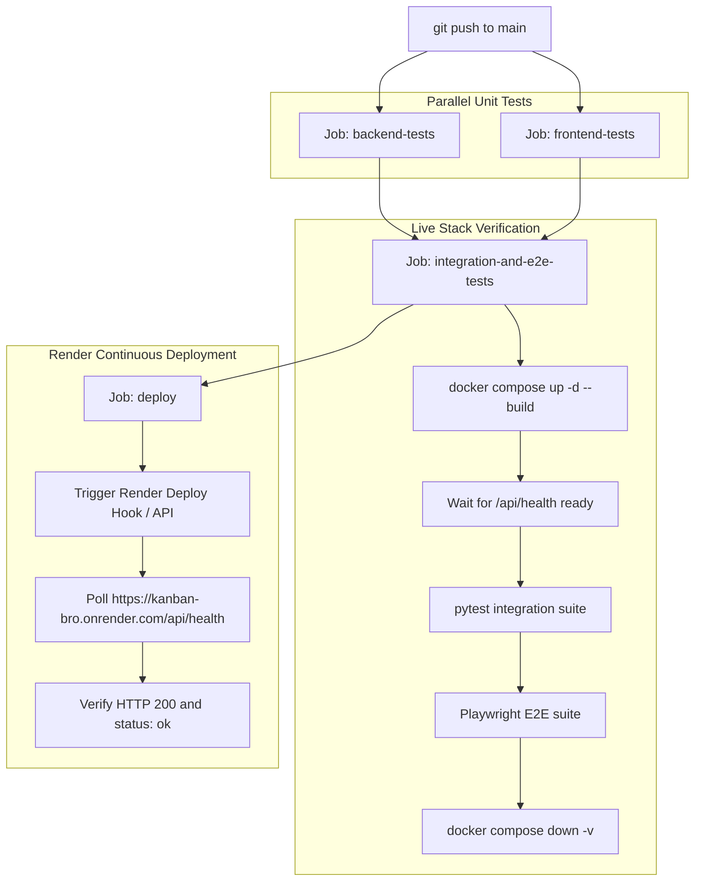

# Render Deployment Guide via GitHub Actions

This guide explains how Kanban Bro's continuous integration and deployment pipeline deploys to **Render** through GitHub, including automated health endpoint validation.

---

## Architecture Overview

---

## 1. Connecting Render to GitHub

1. Push your repository to GitHub.
2. In the [Render Dashboard](https://dashboard.render.com):
   - Click **New +** > **Blueprint**.
   - Connect your GitHub repository.
   - Render automatically reads [`render.yaml`](../render.yaml), creating:
     - **Database**: `kanban-postgres` (PostgreSQL 16)
     - **Web Service**: `kanban-bro` (Docker container built from root `Dockerfile`)

---

## 2. Setting Up the Render Deploy Hook

To ensure Render only deploys **after** all unit, integration, and end-to-end tests pass in GitHub Actions:

1. In Render, go to your **`kanban-bro`** Web Service.
2. Under **Settings**:
   - Set **Auto-Deploy** to **No** (optional, recommended so Render waits for CI tests).
   - Scroll down to **Deploy Hook**.
   - Click **Create Deploy Hook** and copy the generated URL:
     `https://api.render.com/deploy/srv-xxxxxxxxxxxxxxxxxxxx?key=yyyyyyyyyyy`
3. In GitHub, go to your repository > **Settings** > **Secrets and variables** > **Actions**:
   - Add a new repository secret:
     - **Name**: `RENDER_DEPLOY_HOOK_URL`
     - **Value**: The Deploy Hook URL from step 2.

---

## 3. Configuring Repository Secrets & Variables

| Name | Type | Required | Description | Default |
| :--- | :--- | :--- | :--- | :--- |
| `RENDER_DEPLOY_HOOK_URL` | Secret | Recommended | Render service Deploy Hook URL | *(Uses GitHub Auto-Deploy if omitted)* |
| `RENDER_APP_URL` | Variable or Secret | Optional | Public URL of your deployed Render app | `https://kanban-bro.onrender.com` |
| `RENDER_API_KEY` | Secret | Optional | Render API key (if deploying via API) | — |
| `RENDER_SERVICE_ID` | Variable or Secret | Optional | Service ID `srv-...` (if deploying via API) | — |

---

## 4. Pipeline Stages

1. **`backend-tests`**: Runs Python 3.12 unit tests using `uv` and `pytest`.
2. **`frontend-tests`**: Runs in parallel with backend tests; validates TypeScript typing, builds the production bundle, and executes Vitest unit tests.
3. **`integration-and-e2e-tests`**: Spins up the full Docker Compose stack (FastAPI + PostgreSQL), waits for `/api/health`, runs integration tests and the Playwright browser test suite, and then tears down the containers.
4. **`deploy`**: Runs on pushes to `main`. Triggers Render deployment via the Deploy Hook and validates that the live health endpoint (`https://<RENDER_APP_URL>/api/health`) returns HTTP 200 with `{"status": "ok"}`.
